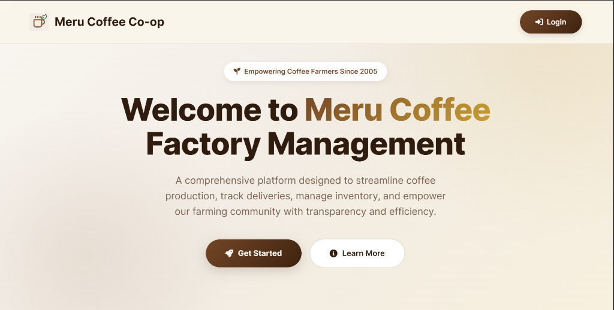
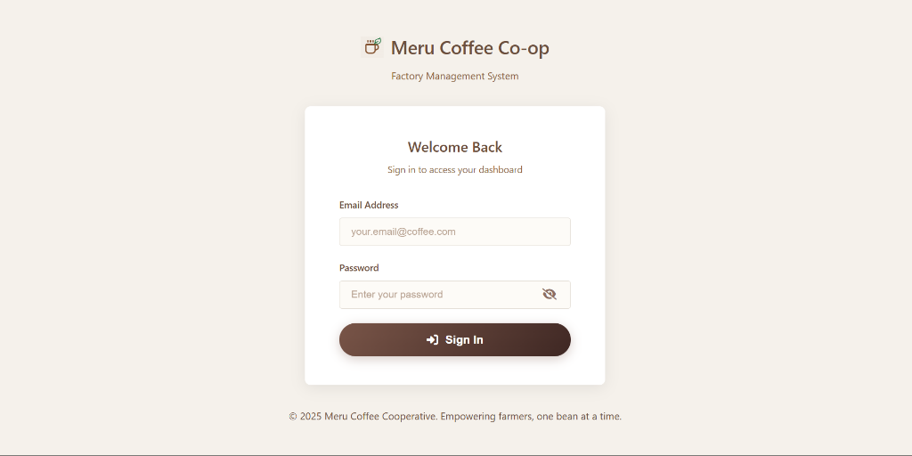
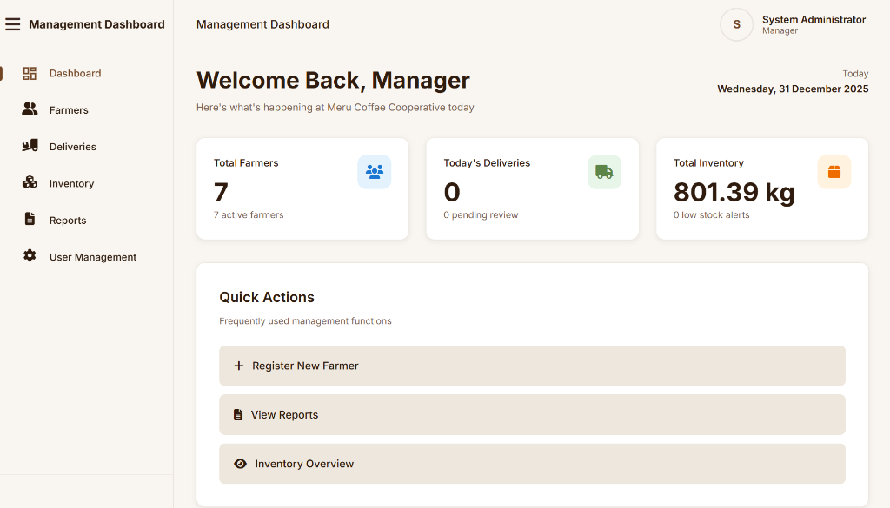
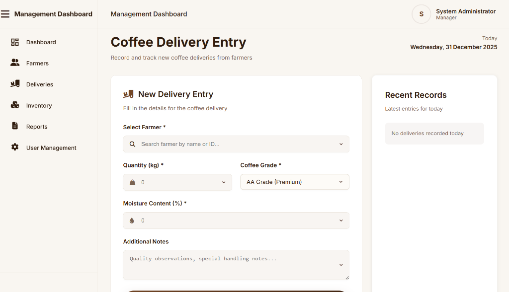
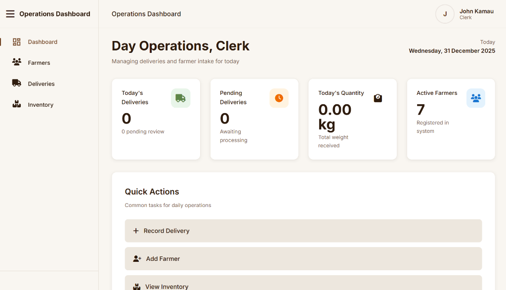

# Coffee Factory Management System

A comprehensive PHP-based Coffee Factory Management System for managing farmers, coffee deliveries, inventory, and reports.

## Technology Stack

- **Backend**: PHP 7.4+
- **Database**: MySQL 5.7+
- **Frontend**: HTML5, CSS3, JavaScript (ES6+)
- **Icons**: Font Awesome 6
- **Server**: Apache (via XAMPP)

### Premium UI & Analytics (v1.1)

- **Standardized Premium UI**: Unified, coffee-themed design system with custom-styled dropdowns, refined typography, and smooth micro-animations.
- **Advanced Reports**: Compact "Insight Cards" replacing large charts for better data density and professional appearance.
- **Advanced Filtering**: Grade-based and status-aware filtering across all reports and inventory views.
- **KPI Dashboards**: Enhanced KPIs for Average Moisture Content and Quality Scores.
- **Security Hardening**: Full POST-based mutation workflow with CSRF tokens and universal XSS escaping.

## Dashboard Overview

- **Manager Dashboard**: High-level production analytics, recent critical alerts, and global inventory status.
- **Clerk Dashboard**: Operational focused view for recording deliveries and monitoring processing stages.
- **Farmer Portal**: Transparent view for farmers to track weight, grade, and historical delivery trends.

## Screenshots

Experience the premium, coffee-themed interface of the Coffee Factory Management System:


_Landing page with modern design and clear call-to-action_


_Secure authentication with elegant UI_


_Comprehensive overview with KPIs and quick actions_


_Streamlined delivery recording with premium form design_


_Operations-focused dashboard for day-to-day tasks_

## Installation

### Prerequisites

- XAMPP (or similar LAMP/WAMP stack)
- PHP 7.4 or higher
- MySQL 5.7 or higher
- Modern web browser

### Setup Instructions

1. **Install XAMPP**

   - Download from [https://www.apachefriends.org/](https://www.apachefriends.org/)
   - Install and start Apache and MySQL services

2. **Clone/Copy Project**

   ```bash
   # Copy the project to XAMPP htdocs folder
   # Default location: C:\xampp\htdocs\coffee-factory-management-system
   ```

3. **Create Database**

   - Open phpMyAdmin: `http://localhost/phpmyadmin`
   - Click "Import" tab
   - Select `database.sql` file from project root
   - Click "Go" to import

4. **Configure Database Connection** (if needed)

   - Edit `config/database.php`
   - Update credentials if different from defaults:
     ```php
     define('DB_HOST', 'localhost');
     define('DB_NAME', 'coffee_factory_cms');
     define('DB_USER', 'root');
     define('DB_PASS', '');
     ```

5. **Access the System**
   - Open browser and navigate to: `http://localhost/coffee-factory-management-system/`
   - You'll be redirected to the login page

### Default Login Credentials

**Manager Account:**

- Email: `admin@coffee.com`
- Password: `admin123`

**Clerk Account:**

- Email: `clerk@coffee.com`
- Password: `admin123`

**Important:** Change these passwords after first login!

## Project Structure

```
coffee-factory-management-system/
├── assets/
│   ├── css/
│   │   └── style.css          # Main stylesheet
│   └── js/
│       └── main.js             # JavaScript utilities
├── config/
│   ├── database.php            # Database connection
│   └── session.php             # Session management
├── includes/
│   ├── functions.php           # Utility functions
│   ├── header.php              # Common header
│   └── footer.php              # Common footer
├── farmers/                    # Farmer management module
├── deliveries/                 # Delivery management module
├── inventory/                  # Inventory management module
├── reports/                    # Reports module
├── users/                      # User management module
├── database.sql                # Database schema
├── index.php                   # Landing page
├── login.php                   # Login page
├── logout.php                  # Logout handler
├── manager-dashboard.php       # Manager dashboard
├── clerk-dashboard.php         # Clerk dashboard
├── farmer-portal.php           # Farmer portal
└── README.md                   # This file
```

## Usage Guide

### For Managers

1. **Dashboard**: View overall statistics and recent activity
2. **Manage Farmers**: Add, edit, view, or deactivate farmers
3. **Monitor Deliveries**: Track all deliveries and their status
4. **Inventory Control**: Monitor stock levels and processing stages
5. **Generate Reports**: View delivery and inventory reports
6. **User Management**: Create and manage system users

### For Clerks

1. **Record Deliveries**: Enter new coffee deliveries from farmers
2. **Process Deliveries**: Move deliveries through quality check workflow
3. **Manage Farmers**: Register new farmers and update information
4. **View Inventory**: Check current stock levels

### For Farmers

1. **View Deliveries**: See personal delivery history
2. **Track Quality Scores**: Monitor quality assessments
3. **Contact Information**: Access factory contact details

## Database Schema

### Main Tables

- **users**: System credentials and roles (Manager, Clerk, Farmer).
- **farmers**: Member profiles with real-time aggregated production stats.
- **deliveries**: Atomic records of coffee weight, moisture, and quality.
- **inventory_batches**: Trackable batches linked to the processing workflow.
- **system_logs**: Comprehensive audit trail for all state-changing actions.

## Security Posture

- **Session Security**: 30-minute absolute session timeout with role-based restriction.
- **CSRF Protection**: Universal token-based protection for all state-changing (POST) requests.
- **XSS Mitigation**: Global `e()` escaping for all rendered user data.
- **Database Safety**: 100% prepared statement usage for all SQL interactions.
- **Role Enforcement**: Strict RBAC verified at both the page and action levels.

## Browser Support

- Chrome (latest)
- Firefox (latest)
- Edge (latest)
- Safari (latest)

## Troubleshooting

### Cannot connect to database

- Ensure MySQL is running in XAMPP
- Check database credentials in `config/database.php`
- Verify database was imported correctly

### Page not found errors

- Check that project is in correct XAMPP htdocs folder
- Verify Apache is running
- Check file permissions

### Login not working

- Clear browser cache and cookies
- Verify database has user records
- Check PHP session configuration

## Support

For issues or questions, please contact the system administrator.

## License

Proprietary - Coffee Factory Management System

## Version

1.0.0 - Initial PHP Release
